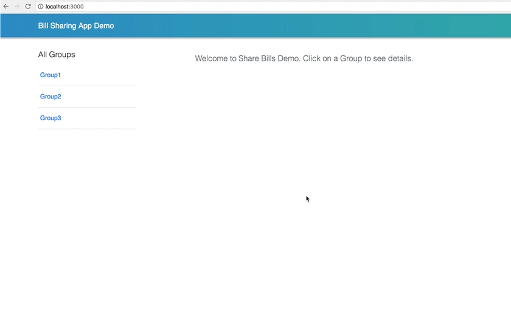
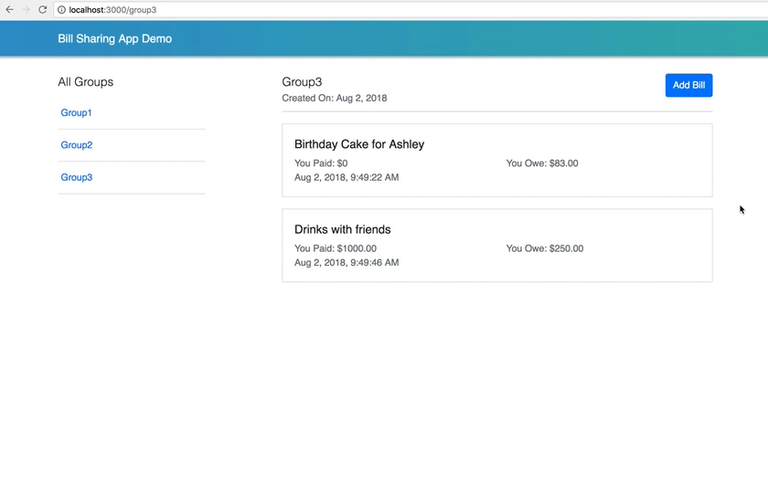
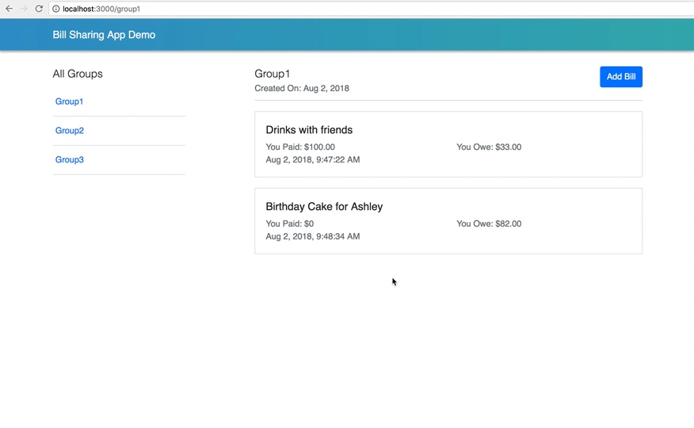

# Project Title
Share Bills Demo using ReactJS

## Description
Single Page Application built with ReactJS which showcases a Bill Sharing Application. Features are as follows:
1)	Add Bill: 
*	Click/Press the Add Bill button
*	Modal pops up
*	Enter information related to the bill
*	Click/Press Save button
*	Modal closes on the Bills Summary Page
2)	View Bills Summary:
*	Shows a list of the summary of Bills
3)	View Bill Details:
*	Click/Press the list item for summary of Bill
*	Expands into the Bills Detail
*	Click/Press on the header of the Bills Detail
*	Collapses back to the list item for summary of the Bill
4. Responsive

## Libraries/Components used
* create-react-app: Starter kit to create a reactjs app.
* bootstrap css (4.1.3): For styling and basic layout.
* react-router-dom (4.3.1): For routing between the search results screen and the detail screen.
* redux, react-redux: For data state management.
* react-toastify: for toast messages

## Getting Started and Installing
These instructions will get you a copy of the project up and running on your local machine for development and testing purposes. See deployment for notes on how to deploy the project on a live system.

* First Git clone the repo into your computer
```
git clone https://github.com/jsphkhan/react-share-bills-demo.git
```
* Open your terminal
```
$ cd react-share-bills-demo
$ npm install
```
* This should install all the dependencies. Once done
* Run 
``` 
$ yarn start
or
$ npm start
```
* to start the server.
* open (http://localhost:3000) in your browser. 
* This should open up the Demo App

## Gif Demo




#### Generating a Production build
```
$ cd react-share-bills-demo
$ npm run build
or
$ yarn build
```

## Live Demo (eg. Now)
I have deployed the demo application into Now(Zeit) server. 
* Live Demo URL: [https://react-share-bills-demo-nriymojfuf.now.sh/](https://react-share-bills-demo-nriymojfuf.now.sh/)


## Assumptions:
* The group information(members in each group) is hardcoded in a json file.
* User should be able to add as many bills as they like
* All bill amounts are split equally
* All bill amounts are entered in the same currency

## Limitations
* Does not have a user login system
* So the default app runs in the perspective of you.

## Possible Improvements
* Better Styling may be.
* Unit Tests - JEST & Enzyme.

## Authors
* **Joseph Khan** - (https://github.com/jsphkhan)

## License
This project is licensed under the MIT License
